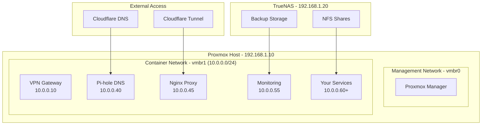

# Proxmox Homelab Template

[](https://opensource.org/licenses/MIT)
[](https://www.proxmox.com/)
[](https://github.com/yourusername/proxmox-homelab-template/actions)

> 🏠 **A production-ready homelab template for Proxmox with LXC containers, full TLS, and GitOps automation**

Welcome to my opinionated and extensible template for deploying a complete homelab infrastructure on Proxmox. This template provides enterprise-grade reliability and security while maintaining the simplicity needed for home use. Inspired by [onedr0p/cluster-template](https://github.com/onedr0p/cluster-template) but designed specifically for Proxmox LXC containers.

## ✨ Features

- 🔐 **Full TLS Everywhere** - Internal CA with automatic certificate generation and renewal
- 🚀 **GitOps Automation** - Commit configuration changes and watch them deploy automatically
- 🏗️ **Infrastructure as Code** - YAML-driven configuration with Git version control
- 🐳 **LXC Containers** - Each service in its own container for maximum isolation
- 🔒 **Security First** - VPN isolation, firewall rules, and security headers
- 📊 **Comprehensive Monitoring** - Prometheus and Grafana with pre-built dashboards
- 💾 **Automated Backups** - Scheduled backups with integrity testing
- 🌐 **Hybrid Access** - Same domains work internally and externally via Cloudflare tunnels
- 🔄 **Zero-downtime Updates** - Smart deployments with automatic rollback
- 📱 **Mobile Friendly** - All services accessible from anywhere with proper SSL

## 🏗️ Architecture Overview



## 🚀 Quick Start

### Prerequisites

- **Proxmox VE 8.0+** with internet access
- **Domain name** with Cloudflare DNS management
- **GitHub account** for GitOps automation
- **NFS storage** (TrueNAS recommended, any NFS server works)
- **VPN account** (NordVPN or compatible for optional VPN routing)

### 1. Fork and Configure

```bash
# Fork this repository on GitHub, then clone your fork
git clone https://github.com/yourusername/proxmox-homelab-template.git
cd proxmox-homelab-template

# Copy configuration template
cp config/cluster.yaml.example config/cluster.yaml

# Edit with your specific settings
nano config/cluster.yaml
```

### 2. Set Up Environment

```bash
# Copy environment template
cp .env.example .env

# Add your credentials (see .env.example for all options)
nano .env
```

### 3. Configure GitHub Secrets

Add these secrets to your GitHub repository (`Settings > Secrets and variables > Actions`):

| Secret Name | Description | Required |
|-------------|-------------|----------|
| `PROXMOX_HOST` | Your Proxmox server IP | ✅ |
| `PROXMOX_TOKEN` | Proxmox API token | ✅ |
| `CLOUDFLARE_API_TOKEN` | Cloudflare API token for DNS | ✅ |
| `CLOUDFLARE_TUNNEL_TOKEN` | Cloudflare tunnel token | ✅ |
| `NORDVPN_PRIVATE_KEY` | NordVPN WireGuard key | Optional |
| `DISCORD_WEBHOOK` | Discord webhook for notifications | Optional |
| `EMAIL_RECIPIENT` | Email for alerts | Optional |

### 4. Deploy Infrastructure

**Option A: GitOps Deployment (Recommended)**
```bash
# Commit your configuration
git add config/cluster.yaml .env
git commit -m "feat: initial homelab configuration"
git push origin main

# First, set up the GitHub Actions runner on your Proxmox host
curl -sSL https://raw.githubusercontent.com/yourusername/proxmox-homelab-template/main/scripts/setup-runner.sh | sudo bash

# Push again to trigger automated deployment
git commit --allow-empty -m "trigger: initial deployment"
git push origin main

# Watch the magic happen in GitHub Actions! 🎉
```

**Option B: Manual Deployment**
```bash
# SSH to your Proxmox host and run
sudo ./scripts/deploy.sh
```

### 5. Access Your Infrastructure

After deployment (5-10 minutes), you'll have:

| Service | URL | Purpose |
|---------|-----|---------|
| **Nginx Proxy Manager** | `https://proxy.yourdomain.com:81` | Reverse proxy management |
| **Pi-hole** | `https://pihole.yourdomain.com/admin` | DNS and ad-blocking |
| **Grafana** | `https://grafana.yourdomain.com` | Monitoring dashboards |

**Default credentials** (change immediately):
- Nginx Proxy Manager: `admin@example.com` / `changeme`
- Pi-hole: `admin` / `admin`
- Grafana: `admin` / `admin`

## 📦 Adding Services

The beauty of this template is how easy it is to add new services using **standard Docker Compose**. Here's how to add Nextcloud as an example:

### 1. Create Service Directory and Configuration

```bash
# Create service directory
mkdir -p config/services/nextcloud

# Create LXC container configuration
cat > config/services/nextcloud/container.yaml << 'EOF'
---
container:
  id: 120
  hostname: "nextcloud"
  ip: "10.0.0.60"
  resources:
    cpu: 2
    memory: 2048
    disk: 20
  nfs_mounts:
    - source: "/mnt/tank/nextcloud"
      target: "/data"
      
certificates:
  domains:
    - "nextcloud.yourdomain.com"
    
external_access:
  cloudflare_tunnel:
    enabled: true
    subdomain: "nextcloud"
EOF

# Create standard Docker Compose file
cat > config/services/nextcloud/docker-compose.yml << 'EOF'
version: '3.8'

services:
  nextcloud:
    image: nextcloud:latest
    container_name: nextcloud
    restart: unless-stopped
    ports:
      - "80:80"
    volumes:
      - /data/nextcloud:/var/www/html
    environment:
      - MYSQL_HOST=db
      - MYSQL_DATABASE=${MYSQL_DATABASE:-nextcloud}
      - MYSQL_USER=${MYSQL_USER:-nextcloud}
      - MYSQL_PASSWORD=${MYSQL_PASSWORD}  # Auto-generated secure password
    depends_on:
      - db
    
  db:
    image: mariadb:latest
    container_name: nextcloud-db
    restart: unless-stopped
    volumes:
      - /data/mysql:/var/lib/mysql
    environment:
      - MYSQL_ROOT_PASSWORD=${MYSQL_ROOT_PASSWORD}  # Auto-generated
      - MYSQL_DATABASE=${MYSQL_DATABASE:-nextcloud}
      - MYSQL_USER=${MYSQL_USER:-nextcloud}
      - MYSQL_PASSWORD=${MYSQL_PASSWORD}  # Auto-generated

# 🔒 SECURITY NOTE:
# - Passwords are automatically generated during deployment
# - Never hardcode passwords in docker-compose.yml files
# - Real passwords are stored in container-local .env files
# - These .env files are never committed to Git
EOF
```

### 2. Commit and Deploy

```bash
# Add the service files
git add config/services/nextcloud/
git commit -m "feat: add Nextcloud file sharing service

- Standard Docker Compose configuration
- MariaDB database included
- External access via Cloudflare tunnel
- NFS storage integration"

git push origin main

# GitHub Actions automatically:
# ✅ Creates LXC container (ID: 120, IP: 10.0.0.60)
# ✅ Installs Docker inside LXC
# ✅ Deploys docker-compose.yml
# ✅ Generates SSL certificates
# ✅ Updates DNS records
# ✅ Configures reverse proxy
# ✅ Sets up monitoring
# ✅ Adds to backup schedule
# ✅ Sends success notification

# 5 minutes later: https://nextcloud.yourdomain.com is live! 🎉
```

### 3. That's It!

Your service is now:
- ✅ **Accessible internally**: `https://nextcloud.yourdomain.com` (via Pi-hole DNS)
- ✅ **Accessible externally**: `https://nextcloud.yourdomain.com` (via Cloudflare tunnel)
- ✅ **Fully secured**: TLS certificates and security headers
- ✅ **Monitored**: Health checks and Grafana dashboards
- ✅ **Backed up**: Automatic daily backups
- ✅ **Auto-updating**: Renovate bot keeps containers updated
- ✅ **Standard tooling**: Use `docker-compose` commands directly

### 4. Managing Your Service

```bash
# SSH into the service container
pct enter 120

# Use standard Docker Compose commands
cd /opt/nextcloud
docker-compose logs -f nextcloud
docker-compose restart nextcloud
docker-compose exec nextcloud bash

# Or use our management scripts
./scripts/health-check.sh --service nextcloud
./scripts/backup.sh --service nextcloud
```

## 🎯 Core Infrastructure

The template provides these foundational services out of the box:

### 🔒 Security & Networking
- **VPN Gateway**: Route specific services through VPN (NordVPN/Surfshark)
- **Pi-hole**: Network-wide ad blocking and local DNS resolution
- **Nginx Proxy Manager**: Reverse proxy with automatic SSL certificates
- **Internal Certificate Authority**: Generate trusted certificates for all services
- **Firewall Rules**: Proper network segmentation and access control

### 📊 Monitoring & Observability
- **Prometheus**: Metrics collection from all services and infrastructure
- **Grafana**: Beautiful dashboards for infrastructure and application metrics
- **Alertmanager**: Smart alerting with Discord/email notifications
- **Health Checks**: Automated service health monitoring with auto-recovery

### 💾 Backup & Recovery
- **Automated Backups**: Daily/weekly/monthly backup schedules
- **Backup Verification**: Integrity testing of all backups
- **Easy Recovery**: One-command restore from any backup point
- **Multiple Destinations**: Local NFS, cloud storage, or both

### 🌐 External Access
- **Cloudflare Integration**: Automatic DNS management and tunnel setup
- **Split-horizon DNS**: Same URLs work internally and externally
- **Cloudflare Access**: Optional authentication for sensitive services
- **Mobile Apps**: All services work perfectly on mobile devices

## 🔧 Service Management

Services are organized using **standard Docker Compose** with additional LXC isolation:

### Service Directory Structure
```
config/services/nextcloud/
├── container.yaml          # LXC container configuration
├── docker-compose.yml      # Standard Docker Compose
└── README.md               # Service documentation (optional)
```

### Service Categories
- **📁 Productivity**: Nextcloud, Vaultwarden, Paperless-ngx
- **🎬 Media**: Jellyfin, Plex, Photoprism
- **⬇️ Downloads**: qBittorrent, SABnzbd, Transmission  
- **📺 *arr Stack**: Sonarr, Radarr, Prowlarr, Lidarr, Readarr
- **🏠 Home Automation**: Home Assistant, ESPHome, Zigbee2MQTT
- **🔧 Utilities**: Uptime Kuma, Portainer, code-server
- **🔍 Monitoring**: Custom dashboards and alerting

### Benefits of Docker Compose + LXC
- ✅ **Standard format**: Use existing Docker Compose files
- ✅ **Maximum isolation**: Each service in its own LXC container
- ✅ **Easy migration**: Copy existing compose files directly
- ✅ **Tool compatibility**: Works with Portainer, docker CLI, etc.
- ✅ **Familiar workflow**: Standard Docker commands work
- ✅ **Community ecosystem**: Leverage existing compose examples

## 📚 Documentation

Comprehensive documentation is available:

- [📖 **Installation Guide**](docs/installation.md) - Step-by-step setup instructions
- [⚙️ **Configuration Reference**](docs/configuration.md) - All configuration options explained
- [🚀 **GitOps Workflow**](docs/gitops.md) - How automated deployment works
- [🔧 **Service Management**](docs/services.md) - Adding, updating, and removing services
- [🔍 **Troubleshooting**](docs/troubleshooting.md) - Common issues and solutions
- [🎯 **Advanced Topics**](docs/advanced.md) - Multi-node, scaling, custom configurations

## 🛡️ Security Features

- **TLS Everywhere**: All services use HTTPS with proper certificates
- **Network Isolation**: VPN traffic isolated from local network
- **Access Control**: Service-level authentication and authorization
- **Security Headers**: HSTS, CSP, and other security headers configured
- **Automated Updates**: Security updates applied automatically
- **Backup Encryption**: All backups encrypted with GPG
- **Audit Logging**: Comprehensive logs for security monitoring
- **Secret Management**: Passwords auto-generated and stored securely

### 🔒 Password Security

The template automatically handles secure password generation:

**❌ Never Do This:**
```yaml
environment:
  - MYSQL_PASSWORD=hardcoded_password123  # Insecure!
```

**✅ Always Do This:**
```yaml
environment:
  - MYSQL_PASSWORD=${MYSQL_PASSWORD}  # Secure variable
```

**How It Works:**
1. During deployment, random passwords are generated
2. Stored in container-local `.env` files (never committed)
3. Docker Compose loads variables automatically
4. Passwords are backed up with encryption

**Manual Password Management:**
```bash
# Generate secure passwords
openssl rand -base64 32

# Store in container .env file (example)
echo "MYSQL_PASSWORD=$(openssl rand -base64 32)" >> /opt/nextcloud/.env
echo "MYSQL_ROOT_PASSWORD=$(openssl rand -base64 32)" >> /opt/nextcloud/.env

# Rotate passwords
./scripts/rotate-passwords.sh nextcloud
```

## 🤖 Automation Features

- **GitOps Deployment**: Infrastructure and services managed through Git
- **Dependency Management**: Renovate automatically updates container images
- **Health Monitoring**: Services auto-restart on failure
- **Certificate Renewal**: SSL certificates renewed automatically
- **Backup Automation**: Scheduled backups with retention policies
- **Alert Management**: Smart notifications with proper escalation

## 🌟 Why This Template?

### vs. Manual Docker Compose
- ✅ **GitOps automation** vs manual deployment
- ✅ **LXC isolation** vs shared Docker host
- ✅ **Infrastructure monitoring** vs basic container stats
- ✅ **Automatic SSL** vs manual certificate management
- ✅ **Integrated backups** vs custom backup scripts
- ✅ **Standard Docker Compose** vs custom formats

### vs. Kubernetes (like onedr0p/cluster-template)
- ✅ **Simpler operations** vs complex Kubernetes management
- ✅ **Better isolation** vs shared kernel containers
- ✅ **Easier troubleshooting** vs kubectl complexity
- ✅ **Lower resource usage** vs Kubernetes control plane overhead
- ✅ **Standard Docker tools** vs specialized Kubernetes knowledge
- ✅ **Familiar Docker Compose** vs Helm charts and manifests

### vs. Proxmox Helper Scripts (tteck)
- ✅ **GitOps automation** vs manual script execution
- ✅ **Ongoing management** vs one-time setup
- ✅ **Enterprise features** vs basic containers
- ✅ **Standardized format** vs individual scripts
- ✅ **Service ecosystem** vs isolated deployments
- ✅ **Professional operations** vs hobby-grade setups

## 🤝 Contributing

Contributions are welcome! Please see [CONTRIBUTING.md](CONTRIBUTING.md) for guidelines.

### Quick Contributing Guide
1. Fork the repository
2. Create a feature branch
3. Add/modify services or infrastructure
4. Test on real Proxmox environment
5. Update documentation
6. Submit pull request

## 🙏 Acknowledgments

This template is inspired by and builds upon excellent work from:

- [onedr0p/cluster-template](https://github.com/onedr0p/cluster-template) - Kubernetes homelab inspiration
- [tteck/Proxmox](https://github.com/tteck/Proxmox) - Proxmox helper scripts
- [linuxserver.io](https://www.linuxserver.io/) - High-quality container images
- The amazing homelab community for sharing knowledge and best practices

## 📄 License

This project is licensed under the MIT License - see the [LICENSE](LICENSE) file for details.

## 🌟 Star History

[](https://star-history.com/#yourusername/proxmox-homelab-template&Date)

---

<div align="center">

**[⭐ Star this repository](https://github.com/yourusername/proxmox-homelab-template)** if you found it helpful!

Made with ❤️ for the homelab community

</div>